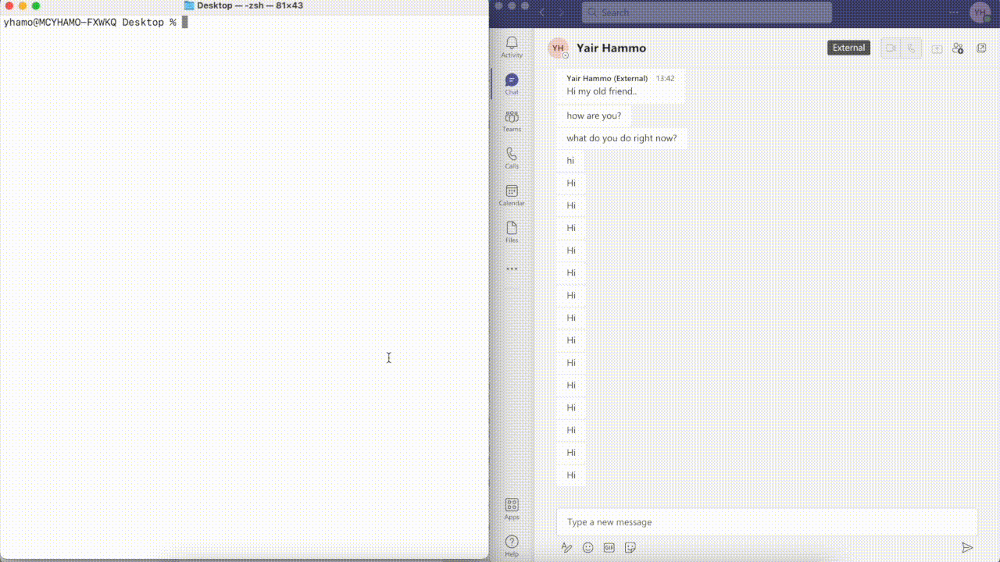
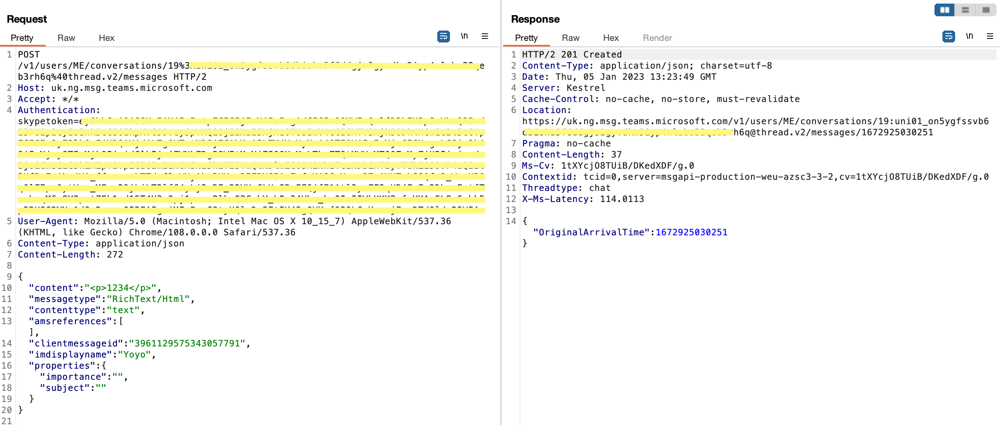
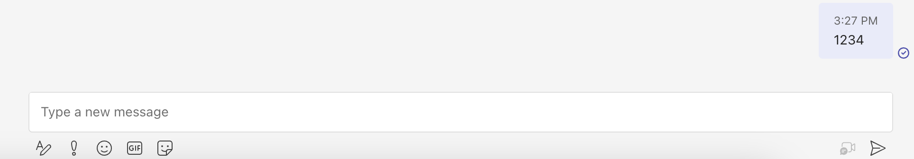
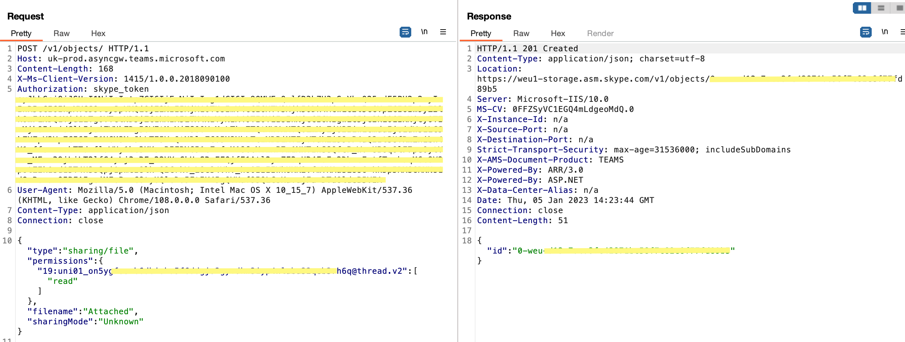
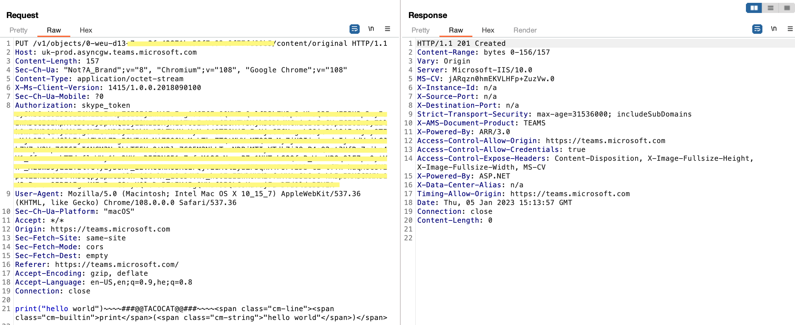
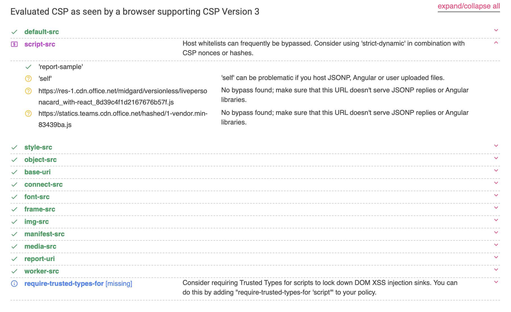
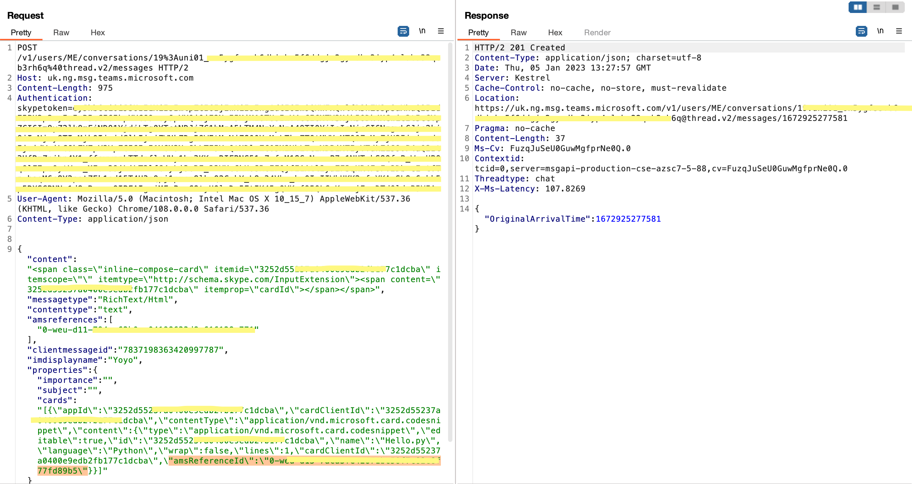
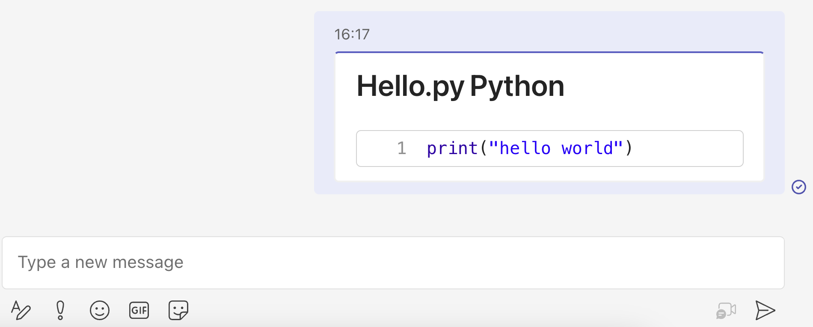

# XSS and other vulnerabilities on Microsoft Teams.

During one of my research projects, I discovered some interesting vulnerabilities on Microsoft Teams. In this article, I will introduce some of them.

One of the vulnerabilities I found allowed me to perform XSS in another user's application, even if the sender was not part of the recipient's organization.

Please note that all the vulnerabilities mentioned in this article have already been fixed by Microsoft.
<p></p>

## Intro to Teams messaging API

Teams subdomains under *.msg.teams.microsoft.com:
- **Request**:
</img>   
- **Appearance on app**
</img>
As we can see from the above (I removed any unnecessary header) for sending a message request we need:
1. **Authorization token** - token we get when we perform login.
2. **Message thread ID** - at the URL path we have the conversation thread ID.
   
The body of the message is structured in HTML format under the **content** section. Microsoft Teams' backend server sanitizes the HTML by removing any JavaScript usage and only allowing desired tags to apear on the massaging thread.

However, over the years, several workarounds for HTML sanitization have been discovered on the Teams application.  
One of them - [XSS + RCE example](https://github.com/oskarsve/ms-teams-rce/blob/main/README.md).  

## Abusing Code-snippet sharing feature

One of the best features of Microsoft Teams is code snippet sharing. This feature allows users to share code snippets over chat, with syntax highlighting for many programming languages.

During my research, I examined the API flow of this feature and found something interesting.

First, let's break down the steps involved in code snippet sharing.

### 1. Code-snippet sharing - getting share-ID

In order to share a code snippet, the client needs first to send the other person's client ID(s) with the desired permissions (read / write) for getting **share-ID token** as we can see below:  

</img>
   
### 2. Code-snippet sharing - uploading our code snippet to the cloud

After getting the share-id, we can now upload the code snippet to the cloud as we can see below:  

</img>
    
As you can see, there is a very interesting delimiter withing the shared message body data: ```~~~~###@@TACOCAT@@###~~~~``` which seperates the clear code, and the way of presenting it over HTML.  
I found this to be an interesting point to exploit, so I removed the delimiter and injected my own HTML content.
To my surprise, I discovered that Microsoft Teams' backend filters my HTML content differently than it does with a normal message. I then attempted to inject some XSS payloads.  

#### CSP bypassing
The main issue with XSS on the Microsoft Teams app is the Content Security Policy, which doesn't seem to have an easy vulnerability. This can be verified using the Chrome extension named **Content Security Policy (CSP) Generator** and evaluating it at csp-evaluator.

Here are the links to both resources:

- [Content Security Policy (CSP) (Chrome extension)](https://chrome.google.com/webstore/detail/content-security-policy-c/ahlnecfloencbkpfnpljbojmjkfgnmdc)
- [Content Security Policy](https://developer.mozilla.org/en-US/docs/Web/HTTP/CSP) 
  
</img>

### 3. Code-snippet sharing - finding XSS on the upload process

As I explained earlier, using the delimiter bypass and modifying the HTML code in the code upload message, only a partial list of HTML tags can bypass the HTML sanitizer.
In this case, in order to bypass CSP, I thought about poping a new window. reminder - we are talking about Teams native application which based on [Electron](https://www.electronjs.org/).  
If I will manage to pop a new window using **target** attribute, I will be able to navigate to any webpage I want, and maybe to [escape Electron's sandboxing](https://book.hacktricks.xyz/network-services-pentesting/pentesting-web/xss-to-rce-electron-desktop-apps) which still seems to be possible today.  
On PortSwigger's [cheat sheet](https://portswigger.net/web-security/cross-site-scripting/cheat-sheet#set-windowname-via-usemap-attribute-in-a-img-tag) I found an interesting tags that can be useful here, ```<map> and <area>```.  
Those tags with modified target to the _blank attribute bypasses the html sanitizer and opens whatever webpage I want. 

HTML exploit code example:  
```HTML
<h1>Hi.. check thi.. please click on my image:</h1>

<map name= 'xss'>
    <area shape='rect' coords='0, 0, 82, 126' target='_blank' href='http://my_malicious_domain.com'>
</map>
```

Later, I found that others uses the outdated angular-jquey version [as shown here](https://medium.com/@numanturle/microsoft-teams-stored-xss-bypass-csp-8b4a7f5fccbf#:~:text=The%20angular%20version%20I%20saw%20was%20outdated%20(%201.5.14%20).%20I%20knew%20now%20that%20I%20could%20pass%20the%20CSP%20with%20this%20version%E2%80%99s%20vulnerabilities%2C%20which%20started%20my%20journey%20on%20some%20local%20tests.%20Later%2C%20I%20saw%20that%20I%20was%20able%20to%20receive%20alerts%20successfully).

### 3. Code-snippet sharing - sending the shared code within a message
The last step, sharing the code-snippet within a message.
Here we will need to attach the share-id.  

</img>
  
And the final solution:  

</img>

### XSS demo
[As you can see](imgs/xss_demo.gif), The payload was sent by an external user, which means that at the time, every organization using Microsoft Teams was vulnerable to such an attack.  

### Trying to achive RCE and a sad ending

I worked on this exploit for a couple of days, trying to understand Microsoft Teams' Electron backend messaging protocol and vulnerabilities. I reverse-engineered their source code from the ASAR file and looked for interesting holes.

Although I managed to do many things, such as changing the window dimensions and downloading files, I wasn't able to achieve a real RCE.

The story ended on a positive note when Microsoft fixed the issue on the new version of Teams before I had a chance to send them my findings.
